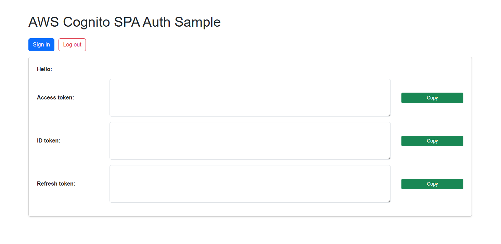

# AWS Cognito SPA Auth Sample

[](https://www.youtube.com/watch?v=6bfCQPxwelY)

[Watch the demo video on YouTube](https://www.youtube.com/watch?v=6bfCQPxwelY)

This is a simple Single Page Application (SPA) example using AWS Cognito for authentication with JavaScript and the `oidc-client-ts` library.

## Features
- Sign in and sign out with AWS Cognito Hosted UI
- Display ID token, access token, and refresh token in styled textareas
- Copy tokens to clipboard
- Responsive, modern UI with Bootstrap
- Securely clears tokens and local/session storage on logout

## Prerequisites
- Node.js (for running local dev servers)
- AWS Cognito User Pool and App Client configured
- Callback and Sign out URLs set in Cognito App Client settings (e.g. `http://localhost:5500/callback`, `http://localhost:5500/`, `http://localhost:5500/index.html`)

## Running Locally

### 1. Using Vite (Recommended for SPA)
```powershell
npm install -g vite
vite --port 5500
```
Open [http://localhost:5500/](http://localhost:5500/) in your browser.

### 2. Using Live Server (VS Code Extension)
- Install the "Live Server" extension in VS Code.
- Right-click `index.html` and select **Open with Live Server**.

### 3. Using http-server (with SPA fallback)
```powershell
npx http-server -p 5500 -c-1 --spa
```

### 4. Using Python (for static serving, not SPA fallback)
```powershell
python -m http.server 5500
```
> Note: For full SPA routing, use Vite or http-server with `--spa`.

## Usage
- Click **Sign In** to authenticate with Cognito.
- After login, tokens will be displayed. Use the green **Copy** buttons to copy tokens.
- Click **Log out** to clear tokens and sign out from Cognito.

## Security
- Tokens are cleared from the UI and browser storage on logout.
- Never expose your real Cognito client secrets in frontend code.

## Customization
- Update Cognito domain, client ID, and redirect URIs in `main.js` as needed for your environment.
- In `main.js`, the `client_id` is replaced with `[PAT HERE]` for safe publishing. Replace `[PAT HERE]` with your actual Cognito App Client ID before running locally.

---

**Happy coding!**
